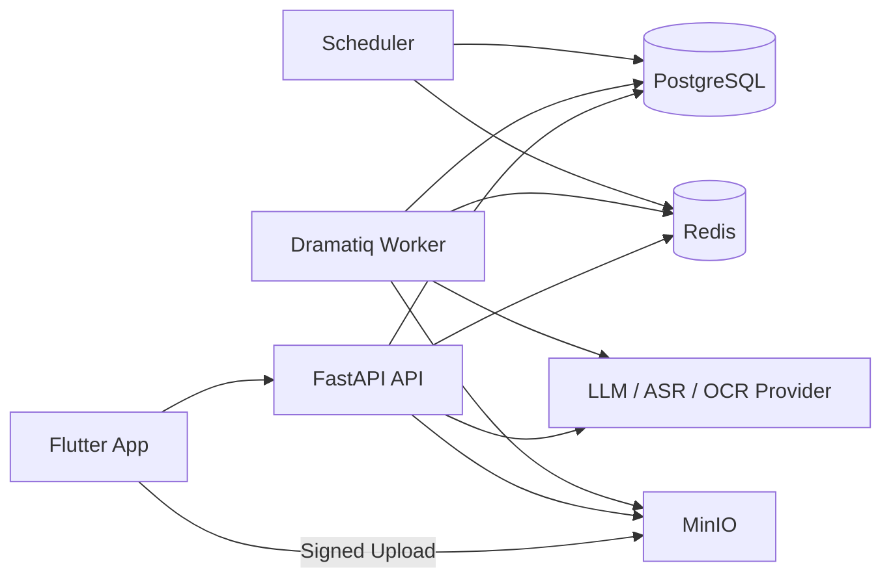

# KnowLink 系统架构设计

## 1. 一句话结论

KnowLink 第一版按 `Flutter 移动端 + FastAPI 模块化单体 + Dramatiq Worker + PostgreSQL/pgvector + Redis + MinIO` 开工，先做“单用户、单课程、单次学习闭环”的 MVP，不拆微服务，不做全量实时流。

### 1.1 当前仓库状态

- 当前仓库已调整为“可让组员并行开工的骨架版”，不是“真实基础设施已全量接通”的完成版。
- 已就位：`router -> service -> repository` 依赖方向、`memory` demo 适配器、AI pipeline 占位、解析器占位、任务 payload、worker / scheduler 占位、Flutter `qa` 独立页面与 course-flow 状态骨架。
- 已接纳：`courses`、`course_resources`、`parse_runs`、`async_tasks` 四张基础表的 SQLAlchemy model 与 Alembic 初始化迁移。
- 第 1 周基础设施交付口径是 scaffold：本地编排、配置、基础迁移、仓储协议、内存态 demo 和任务占位已完成。
- 占位未接通：完整 SQLAlchemy 持久化仓储、基础四表之外的业务表、Redis/MinIO 真正读写、Dramatiq broker、真实 worker 消费、OCR/ASR/LLM Provider；这些进入第 2 周起的真实接入范围。
- 文档中的 MVP 承诺表示“接口与模块边界冻结”，具体实现状态以 README 和 [docs/development-scaffold.md](./docs/development-scaffold.md) 为准。
- 曹乐 owner 的 Week 1 冻结项与固定联调资料集基线以 [docs/contracts/week1-cao-le-freeze.md](./docs/contracts/week1-cao-le-freeze.md) 和 [docs/demo-assets-baseline.md](./docs/demo-assets-baseline.md) 为准。

---

## 2. 目标、边界与成功标准

### 2.1 MVP 目标

在移动端完整跑通以下链路：

`导入或推荐课程 -> 上传资料 -> 预解析 -> AI 个性化问询 -> 生成互动讲义 -> 围绕讲义块问答 -> 自动测验 -> 复习推荐`

### 2.2 MVP 范围

- 1 个用户
- 1 门课程
- 1 个主视频
- 1~3 个配套资料，`MP4 + PDF + PPTX + DOCX` 为 MVP 硬承诺，`SRT` 为可选辅助输入
- 1 套互动讲义
- 1 个块级问答会话
- 1 组测验
- 1 组复习推荐

### 2.3 非目标

- 社交、排行榜、评论
- 多人协作
- 当前阶段不落通用在线视频平台抓取实现，B 站单视频导入只预留接口 contract
- 快应用工程实现
- 全量 WebSocket 流式输出
- 复杂知识图谱
- 离线下载与离线学习
- 主观题自动判卷

### 2.4 成功标准

- 用户能在 Flutter App 内完成一次完整学习闭环。
- 任一讲义块、问答答案、测验题都能回溯到合法来源引用。
- 关键写接口可幂等重试，不会生成重复资源、重复任务或重复版本。
- 重解析、重生成不会污染旧版本数据。

### 2.5 MVP 硬边界

- 鉴权采用单 demo 用户方案：后端种子化 1 个用户，Flutter 通过环境变量 `KNOWLINK_DEMO_TOKEN` 携带固定 Bearer token。
- 智能课程推荐必须是真实可用能力，而不是页面 mock。
- 推荐来源固定为 `course_catalog` 种子目录，不接外部课程平台抓取；B 站单视频导入当前只冻结接口，不接通下载运行时。
- 推荐策略采用“规则排序 + AI 推荐理由文案”组合，确保 4 周内可稳定落地。
- 策划书中的“移动端 APP / 快应用”按本仓边界收敛为“Flutter APP 交付优先”，快应用不在当前代码仓实现。

### 2.6 比赛展示映射

| 策划书页面 | Flutter Route | 主要接口/数据承接 | 当前骨架状态 |
|---|---|---|---|
| 首页 | `/` | `GET /api/v1/home/dashboard` | 已有 route，dashboard 已承接最近学习、复习任务、今日推荐知识点、学习统计 |
| 自主导入页 | `/import` | 上传链路与资源清单接口 | 已有 route，资料类型承接 `mp4/pdf/pptx/docx` |
| 智能课程推荐页 | `/recommend` | `POST /api/v1/recommendations/courses` | 已有 route 与推荐 provider |
| 解析进度页 | `/courses/:courseId/progress` | `GET /api/v1/courses/{courseId}/pipeline-status` | 已有 route，接口承接来源整理、知识映射、重点摘要 |
| AI 个性化问询页 | `/courses/:courseId/inquiry` | `GET/POST inquiry` | 已承接目标、掌握程度、时间预算、讲义偏好、解释粒度 |
| 个性化互动讲义页 | `/courses/:courseId/handout` | handout、jump-target、QA route | 已承接讲义与独立 QA 子路由 |
| 测验页 | `/quizzes/:quizId` | quiz detail / attempts | 已承接题目、分数、掌握度变化、复习联动 |
| AI 复习推荐页 | `/courses/:courseId/review` | review task list / regenerate | 已承接推荐原因、回看片段、再练入口、顺序与强度 |

---

## 3. 设计原则

### 3.1 模块化单体优先

- API、异步任务、AI 编排、解析逻辑在一个代码仓内维护。
- 运行时拆成 `api`、`worker`、`scheduler` 三个进程，而不是拆服务。
- 只有在吞吐量、团队规模或租户复杂度明显上升后再考虑服务拆分。

### 3.2 异步优先

- 上传完成、创建课程、提交答案是同步请求。
- 解析、向量化、讲义生成、测验预生成、复习重算全部走异步任务。
- 前端统一读聚合状态，不拼接底层任务状态。

### 3.3 版本化产物

- 解析结果按 `parse_run` 版本隔离。
- 讲义按 `handout_version` 隔离。
- 新版本未 ready 前，旧版本继续可读。

### 3.4 课程内 AI 约束

- 所有 AI 行为都必须带 `courseId`。
- 问答、讲义、测验、复习建议只允许检索当前课程内的材料。
- 页码、时间戳、slide 编号由服务端根据结构化引用生成，不允许模型自由编造。

### 3.5 读写分层

- PostgreSQL 保存业务真相。
- `pgvector` 保存统一向量读模型。
- MinIO 保存原始文件与衍生产物。
- Redis 保存任务队列、幂等键、热点缓存与上传 session。

---

## 4. 技术选型

| 层 | 选型 | 说明 |
|---|---|---|
| 移动端 | Flutter 3.x + Dart 3.x | 移动端一套代码，适合视频、文档、问答、测验混合页面 |
| 路由 | `go_router` | 路由集中管理 |
| 状态管理 | `flutter_riverpod` | 管理页面状态、课程上下文、轮询与播放器联动 |
| 网络 | `dio` | 统一拦截器、重试、超时和错误映射 |
| 后端 API | FastAPI | 类型友好、Swagger 友好、适合 MVP |
| ORM | SQLAlchemy 2.x | 支持复杂查询和关联建模 |
| 数据库 | PostgreSQL 16 + `pgvector` | 一个数据库内同时处理关系数据和向量检索 |
| 异步任务 | Dramatiq + Redis | 部署简单，足够支撑 MVP |
| 对象存储 | MinIO | 自建友好，兼容 S3 签名上传 |
| 数据迁移 | Alembic | 管理表结构演进 |
| AI 能力 | LLM / ASR / OCR Provider | 通过统一 `ai` 适配层接入 |

> 备注：MVP 明确选择 Dramatiq，不再保留 Celery/RQ 三选一的不确定性。

---

## 5. 系统上下文与部署拓扑



### 5.1 运行形态

- `api`：对 Flutter 提供 REST API、签名上传、聚合状态查询。
- `worker`：消费解析、讲义、测验、复习相关任务。
- `scheduler`：定时重算复习任务、清理缓存、巡检超时任务。
- `postgres`：业务真相源与向量读模型。
- `redis`：队列、幂等、缓存、分布式锁。
- `minio`：原始文件、页面截图、字幕、导出 JSON/Markdown。

### 5.2 自建部署建议

- 开发环境：`docker compose` 起 `api + worker + scheduler + postgres + redis + minio`。
- 测试/生产环境：同一镜像多进程部署，最少分成 `api` 和 `worker` 两类副本。
- 日志：JSON 结构化日志，贯穿 `requestId`、`courseId`、`parseRunId`、`taskId`。

---

## 6. 模块职责

### 6.1 Flutter 客户端

负责：

- 登录态与课程上下文
- 文件选择与直传对象存储
- 轮询课程聚合状态
- 视频播放器、PDF 预览、讲义阅读
- 问答交互、测验交互、复习任务展示

不负责：

- 解析文件
- 生成引用
- 判分逻辑
- 讲义、测验、复习任务的实际生成

### 6.2 API 服务

负责：

- 课程、资源、问询、讲义、问答、测验、复习的同步接口
- 状态聚合
- 幂等控制
- 权限校验
- 任务入队

### 6.3 Worker

负责：

- 视频字幕提取与 ASR
- PDF/PPTX/DOCX 结构化
- OCR、关键帧抽取
- 知识点抽取与向量化
- 讲义、测验、复习任务生成

### 6.4 AI 编排层

负责：

- 统一封装 LLM / ASR / OCR Provider
- Prompt 模板与 JSON Schema 校验
- RAG 检索、rerank、引用反查
- 输出内容安全与格式校验

---

## 7. 推荐工程目录

### 7.1 后端

```text
server/
  Dockerfile
  app.py
  config/
    logging.py
    settings.py
  api/
    app_factory.py
    deps.py
    response.py
    router.py
    routers/
      bilibili.py
      courses.py
      handouts.py
      health.py
      home.py
      inquiry.py
      pipelines.py
      progress.py
      qa.py
      quizzes.py
      recommendations.py
      resources.py
      reviews.py
  domain/
    models/
      records.py
    repositories/
      interfaces.py
    services/
      bilibili.py
      courses.py
      handouts.py
      home.py
      inquiry.py
      pipelines.py
      progress.py
      qa.py
      quizzes.py
      recommendations.py
      resources.py
      reviews.py
  schemas/
    base.py
    common.py
    requests.py
    responses.py
  tasks/
    broker.py
    payloads.py
    scheduler.py
    worker.py
  ai/
    pipelines/
      base.py
      handout.py
      inquiry.py
      qa.py
      quiz.py
      recommendation.py
      review.py
  parsers/
    base.py
    video.py
    pdf.py
    pptx.py
    docx.py
    normalize.py
  infra/
    auth.py
    db/
      base.py
      dependencies.py
      session.py
      models/
        async_task.py
        course.py
        parse_run.py
        resource.py
    queue/
    repositories/
      memory.py
      memory_runtime.py
    storage/
  seeds/
    course_catalog.json
    demo_assets_manifest.json
  tests/
    test_api.py
    test_contract_freeze.py
    test_scaffold_consistency.py
```

说明：

- 不单独保留 `controller` 层，FastAPI 的 router + service 已足够。
- `domain` 只承载业务语义，不依赖 HTTP。
- `infra/repositories/memory.py` 是当前 demo 适配器；真实仓储后续按同一协议替换。
- `infra` 统一放数据库、队列、对象存储和仓储适配器等基础设施封装。
- 以上是当前关键骨架快照；历史兼容文件已经移除，不再出现在目录树中。

### 7.2 Flutter

```text
client_flutter/
  lib/
    main.dart
    app/
      app.dart
      router/
        app_router.dart
      theme/
        app_theme.dart
    core/
      config/
        app_config.dart
      network/
        api_client.dart
      widgets/
        app_scaffold.dart
    shared/
      models/
        course_flow_state.dart
        recommendation_card.dart
      providers/
        course_flow_providers.dart
        course_recommend_provider.dart
    features/
      home/
      course_import/
      course_recommend/
      parse_progress/
      inquiry/
      handout/
      qa/
      quiz/
      review/
  test/
    shared/
      course_flow_providers_test.dart
    smoke_test.dart
```

Flutter 自动化测试目录为 `client_flutter/test/`，当前包含 `smoke_test.dart` 与 `shared/course_flow_providers_test.dart`。

### 7.3 仓库级资产

```text
docs/
  contracts/
    api-contract.md
    error-codes.md
    week1-cao-le-freeze.md
  development-scaffold.md
  demo-assets-baseline.md
  demo-assets-first-edition.md
schemas/
  ai/
    handout_block.schema.json
    handout_blocks.schema.json
    handout_outline.schema.json
    qa_response.schema.json
    quiz_generation.schema.json
    review_tasks.schema.json
  parse/
    normalized_document.schema.json
.github/
  workflows/
    ci.yml
client_flutter/
  test/
    smoke_test.dart
server/
  seeds/
docker-compose.yml
.env.example
pyproject.toml
README.md
```

---

## 8. 核心状态模型

## 8.1 课程状态拆分

`courses` 不再用一个字段混合生命周期和流水线状态，改成以下四类字段：

| 字段 | 含义 | 枚举 |
|---|---|---|
| `lifecycle_status` | 课程当前是否可用 | `draft` `resource_ready` `inquiry_ready` `learning_ready` `archived` `failed` |
| `pipeline_stage` | 当前主学习流水线阶段 | `idle` `upload` `parse` `inquiry` `handout` |
| `pipeline_status` | 当前阶段的执行态 | `idle` `queued` `running` `partial_success` `succeeded` `failed` |
| `active_parse_run_id` | 当前生效解析版本 | 指向 `parse_runs.id` |

状态含义：

- `draft`：课程已创建，但还没有达到最低可解析资源条件。
- `resource_ready`：已有最低可用资源，可发起解析。
- `inquiry_ready`：解析完成，已产出课程摘要与讲义目录；完整知识点可随讲义块按需生成，允许问询。
- `learning_ready`：已有可用讲义版本，允许学习。
- `failed`：课程不可用，需要人工处理或重新导入。

当前骨架已覆盖的状态迁移：

| 触发事件 | 当前课程状态变化 | 当前仓库口径 |
|---|---|---|
| `POST /api/v1/courses` | `draft / idle / idle` | 已在 `server/infra/repositories/memory_runtime.py` 与 `server/tests/test_api.py` 覆盖 |
| `POST /api/v1/courses/{courseId}/resources/upload-complete` | 课程级状态暂不变更；资源记录进入 `ingestStatus=ready`、`validationStatus=passed`、`processingStatus=pending` | 当前 scaffold 只把“资源已就绪”落在 `course_resources`，还没有单独推进到课程级 `resource_ready / upload / succeeded` |
| `POST /api/v1/courses/{courseId}/parse/start` | `draft / idle / idle -> inquiry_ready / parse / succeeded`，并更新 `active_parse_run_id` | 已在 `parse/start`、`pipeline-status` 及相关 pytest 中覆盖 |
| `POST /api/v1/courses/{courseId}/handouts/generate` | `inquiry_ready / parse / succeeded -> learning_ready / handout / succeeded`，并更新 `active_handout_version_id` | 已在 handout 生成、blocks、jump-target、QA 链路中覆盖 |

补充说明：

- `resource_ready`、`upload`、`queued`、`running`、`partial_success`、`archived`、`failed` 仍然是冻结 contract 的合法状态枚举。
- 当前内存态 scaffold 还没有把这些中间态和失败态接成完整运行时状态机，因此文档中的状态全集与“当前已覆盖迁移”需要分开理解。

## 8.2 解析版本线

`parse_runs`

| 字段 | 说明 |
|---|---|
| `status` | `queued` `running` `partial_success` `succeeded` `failed` `canceled` `superseded` |
| `trigger_type` | `user_action` `retry` `scheduler` `system_repair` |
| `source_parse_run_id` | 由旧解析版本派生或重试时记录来源 |

规则：

- 每次重解析都创建新的 `parse_run`。
- 只有 `parse_run.status = succeeded` 时，课程的 `active_parse_run_id` 才切换。
- 新 run 生效前，旧 run 对应的讲义、引用和问答仍然可读。

## 8.3 异步任务状态

`async_tasks`

| 字段 | 说明 |
|---|---|
| `task_type` | `parse_pipeline` `resource_validate` `subtitle_extract` `asr` `doc_parse` `ocr` `knowledge_extract` `embed` `handout_generate` `handout_outline` `handout_block_generate` `quiz_generate` `review_refresh` `review_rank` |
| `status` | `queued` `running` `succeeded` `failed` `retrying` `canceled` `skipped` |
| `parse_run_id` | 可选，任务所依赖的解析版本 |
| `parent_task_id` | 可选，父任务 ID；根任务为空 |
| `target_type` | 可选，任务要生成或更新的领域实体类型 |
| `target_id` | 可选，任务对应的目标实体 ID |
| `progress_pct` | 0~100 |
| `step_code` | 用于前端步骤条聚合 |

规则：

- 当前仓库的第 1 周口径只冻结 `async_tasks` 状态枚举、表结构、payload 和 worker / scheduler 占位；内存态 scaffold 的同步产物生成不代表真实异步运行时。
- 真实任务状态流转、Dramatiq broker 与 worker 消费从第 2 周上传 / 解析链路开始接入。
- `async_tasks` 同时承载根任务和子任务。
- 每次异步触发接口返回的 `taskId` 固定指向根任务。
- 解析流程会先创建 `task_type = parse_pipeline` 的根任务，再派生多个资源级或步骤级子任务。
- 讲义、测验、复习重算的 `generation_task_id` 都指向对应实体当前或最近一次根任务。

## 8.4 讲义版本状态

`handout_versions`

| 字段 | 说明 |
|---|---|
| `status` | `draft` `generating` `outline_ready` `ready` `partial_success` `failed` `superseded` |
| `version_no` | 课程内递增 |
| `source_parse_run_id` | 基于哪次解析结果生成 |
| `generation_task_id` | 当前或最近一次讲义生成任务 |
| `strategy_snapshot_json` | 生成讲义时的用户偏好快照 |

规则：

- 每次“重新生成讲义”都会创建新的 `handout_version`。
- 讲义块、引用、预生成测验都归属到具体 `handout_version`。
- `outline_ready` 表示目录可展示但 block 正文未全生成。
- `ready` 表示必要 block 全 ready。
- `partial_success` 表示目录可用但部分 block 失败或降级。

---

## 9. 数据存储设计

### 9.1 存储分层

| 存储 | 保存内容 | 说明 |
|---|---|---|
| MinIO | 原始视频、PDF、PPTX、DOCX、字幕、关键帧、页图、导出 JSON/MD | 大对象与衍生产物 |
| PostgreSQL | 课程、资源、解析版本线、后台任务、结构化解析结果、问答、测验、掌握度、复习任务 | 业务真相源 |
| `pgvector` | `vector_documents` 表 | 统一的 RAG 向量读模型 |
| Redis | 任务队列、缓存、幂等键、上传 session、分布式锁 | 临时态与热点数据 |

### 9.2 对象存储目录

```text
raw/{userId}/{courseId}/{resourceId}/original.xxx
derived/{courseId}/{resourceId}/subtitle.srt
derived/{courseId}/{resourceId}/pages/001.png
derived/{courseId}/{resourceId}/slides/001.png
derived/{courseId}/{resourceId}/keyframes/001.jpg
exports/{courseId}/handouts/v{versionNo}.json
exports/{courseId}/handouts/v{versionNo}.md
```

---

## 10. 核心数据模型

> 所有表默认包含：`id`、`created_at`、`updated_at`。  
> 默认主键使用 `bigint`，时间使用 `timestamptz`，扩展字段使用 `jsonb`。

### 10.1 用户与课程

#### `users`

- `mobile`
- `email`
- `nickname`
- `avatar_url`
- `timezone`
- `status`

#### `courses`

- `user_id`
- `title`
- `entry_type`
- `goal_text`
- `exam_at`
- `cover_url`
- `summary`
- `lifecycle_status`
- `pipeline_stage`
- `pipeline_status`
- `active_parse_run_id`
- `active_handout_version_id`
- `last_error`
- `meta_json`

关键索引：

- `(user_id, updated_at desc)`
- `(user_id, lifecycle_status)`

#### `course_catalog`

- `title`
- `provider`
- `level`
- `estimated_hours`
- `tags_json`
- `default_resource_manifest_json`

说明：

- `course_catalog` 由种子数据初始化，MVP 不依赖外部同步任务。
- 推荐页只允许从 `course_catalog` 中选课，再通过确认入课生成用户侧 `courses`。

### 10.2 资源与流水线

#### `course_resources`

- `course_id`
- `resource_type`
- `source_type`
- `origin_url`
- `object_key`
- `preview_key`
- `original_name`
- `mime_type`
- `size_bytes`
- `checksum`
- `ingest_status`
- `validation_status`
- `processing_status`
- `last_parse_run_id`
- `last_error`
- `parse_policy_json`
- `sort_order`

关键索引：

- `(course_id, ingest_status)`
- `(course_id, validation_status)`
- `(course_id, processing_status)`
- `(checksum)`

#### `parse_runs`

- `course_id`
- `status`
- `trigger_type`
- `source_parse_run_id`
- `progress_pct`
- `summary_json`
- `started_at`
- `finished_at`

关键索引：

- `(course_id, created_at desc)`
- `(course_id, status)`

#### `async_tasks`

- `parse_run_id nullable`
- `course_id`
- `resource_id nullable`
- `task_type`
- `status`
- `parent_task_id nullable`
- `target_type nullable`
- `target_id nullable`
- `step_code`
- `progress_pct`
- `payload_json`
- `result_json`
- `error_code`
- `error_message`
- `retry_count`
- `started_at`
- `finished_at`

关键索引：

- `(parse_run_id, status)`
- `(parent_task_id, status)`
- `(course_id, task_type, status)`
- `(course_id, target_type, target_id)`
- `(resource_id, status)`

### 10.3 解析产物

#### `course_segments`

- `course_id`
- `resource_id`
- `parse_run_id`
- `segment_type`
- `title`
- `section_path`
- `text_content`
- `plain_text`
- `start_sec nullable`
- `end_sec nullable`
- `page_no nullable`
- `slide_no nullable`
- `image_key nullable`
- `formula_text nullable`
- `bbox_json nullable`
- `order_no`
- `token_count`
- `is_active`

关键索引：

- `(course_id, parse_run_id, order_no)`
- `(course_id, parse_run_id, start_sec)`
- `(course_id, parse_run_id, page_no)`

#### `knowledge_points`

- `course_id`
- `parse_run_id`
- `parent_id nullable`
- `display_name`
- `canonical_name`
- `description`
- `difficulty_level`
- `importance_score`
- `aliases_json`
- `is_active`

关键约束：

- `unique(course_id, parse_run_id, canonical_name)`

#### `segment_knowledge_points`

- `segment_id`
- `knowledge_point_id`
- `relevance_score`

#### `knowledge_point_evidences`

- `knowledge_point_id`
- `segment_id`
- `evidence_type`
- `sort_no`

> 不再把知识点关系存在 JSON 里。`course_segments`、`knowledge_points` 和各类引用表的所有可追溯关系都必须可 JOIN。

### 10.4 学习偏好与讲义

#### `learning_preferences`

- `user_id`
- `course_id`
- `goal_type`
- `self_level`
- `time_budget_minutes`
- `exam_at`
- `preferred_style`
- `example_density`
- `formula_detail_level`
- `language_style`
- `focus_knowledge_json`
- `inquiry_answers_json`
- `confirmed_at`

#### `handout_versions`

- `course_id`
- `source_parse_run_id`
- `generation_task_id`，FK -> `async_tasks.id`，重试时更新为最新一次生成任务
- `version_no`
- `status`
- `title`
- `summary`
- `outline_json`
- `style_profile_json`
- `strategy_snapshot_json`
- `total_blocks`
- `generated_by`

关键约束：

- `unique(course_id, version_no)`

#### `handout_blocks`

- `handout_version_id`
- `course_id`
- `outline_key`
- `block_type`
- `title`
- `summary`
- `content_md nullable`
- `content_text nullable`
- `start_sec nullable`
- `end_sec nullable`
- `page_from nullable`
- `page_to nullable`
- `estimated_minutes`
- `order_no`
- `status`
- `style_json`

#### `handout_block_knowledge_points`

- `handout_block_id`
- `knowledge_point_id`
- `sort_no`
- `importance_score`

说明：

- block 归属不写入 `knowledge_points` 主表。
- 不同 block 抽到相同 `canonical_name` 时复用同一 `knowledge_point_id`，并通过 `handout_block_knowledge_points` 表记录 block 内排序和重要性。

### 10.5 引用、问答、测验、复习

#### `handout_block_refs`

- `handout_block_id`
- `resource_id`
- `segment_id nullable`
- `ref_type`
- `quote_text`
- `page_no nullable`
- `slide_no nullable`
- `start_sec nullable`
- `end_sec nullable`
- `bbox_json nullable`
- `ref_label`
- `sort_no`

#### `qa_message_refs`

- `qa_message_id`
- `resource_id`
- `segment_id nullable`
- `ref_type`
- `quote_text`
- `page_no nullable`
- `slide_no nullable`
- `start_sec nullable`
- `end_sec nullable`
- `bbox_json nullable`
- `ref_label`
- `sort_no`

#### `quiz_question_refs`

- `quiz_question_id`
- `resource_id`
- `segment_id nullable`
- `ref_type`
- `quote_text`
- `page_no nullable`
- `slide_no nullable`
- `start_sec nullable`
- `end_sec nullable`
- `bbox_json nullable`
- `ref_label`
- `sort_no`

#### `review_task_refs`

- `review_task_id`
- `resource_id`
- `segment_id nullable`
- `ref_type`
- `quote_text`
- `page_no nullable`
- `slide_no nullable`
- `start_sec nullable`
- `end_sec nullable`
- `bbox_json nullable`
- `ref_label`
- `sort_no`

> 引用按实体专属表存储，保持数据库级完整性，不再使用多态 owner 字段。

#### `qa_sessions`

- `user_id`
- `course_id`
- `handout_version_id`
- `handout_block_id`
- `status`
- `context_snapshot_json`
- `message_count`
- `last_message_at`

#### `qa_messages`

- `session_id`
- `role`
- `content_md`
- `content_text`
- `answer_type`
- `latency_ms`
- `token_usage_prompt`
- `token_usage_completion`
- `safety_flag`

#### `quizzes`

- `course_id`
- `handout_version_id`
- `handout_block_id nullable`
- `knowledge_point_id nullable`
- `quiz_type`
- `status`
- `question_count`
- `difficulty_target`
- `source_parse_run_id`
- `generation_task_id`，FK -> `async_tasks.id`，重试时更新为最新一次生成任务

#### `quiz_questions`

- `quiz_id`
- `knowledge_point_id nullable`
- `question_type`
- `stem_md`
- `options_json`
- `correct_answer_json`
- `explanation_md`
- `difficulty_level`
- `order_no`

#### `quiz_attempts`

- `quiz_id`
- `user_id`
- `course_id`
- `status`
- `score`
- `total_score`
- `accuracy`
- `duration_sec`
- `submitted_answers_json`
- `result_json`
- `submitted_at`

#### `quiz_attempt_items`

- `attempt_id`
- `question_id`
- `user_answer_json`
- `is_correct`
- `obtained_score`
- `explanation_snapshot_md`

#### `mastery_records`

- `user_id`
- `course_id`
- `knowledge_point_id`
- `mastery_score`
- `confidence_score`
- `correct_count`
- `wrong_count`
- `last_quiz_at`
- `last_review_at`
- `next_review_at`
- `review_priority`
- `source_json`

关键约束：

- `unique(user_id, course_id, knowledge_point_id)`

#### `review_task_runs`

- `course_id`
- `user_id`
- `generation_task_id`，FK -> `async_tasks.id`，重试时更新为最新一次重算任务
- `trigger_type`
- `status`
- `generated_count`
- `reason_json`

#### `review_tasks`

- `review_task_run_id`
- `user_id`
- `course_id`
- `knowledge_point_id nullable`
- `handout_block_id nullable`
- `task_type`
- `priority_score`
- `reason_tags_json`
- `reason_text`
- `recommended_action_json`
- `recommended_minutes`
- `due_at`
- `status`

#### `user_course_progress`

- `user_id`
- `course_id`
- `handout_version_id`
- `last_handout_block_id`
- `last_video_resource_id`
- `last_position_sec`
- `last_doc_resource_id`
- `last_page_no`
- `last_activity_at`

### 10.6 向量读模型

#### `vector_documents`

- `course_id`
- `parse_run_id`
- `handout_version_id nullable`
- `owner_type`：`segment` `handout_block` `knowledge_point`
- `owner_id`
- `resource_id nullable`
- `content_text`
- `metadata_json`
- `embedding vector`

说明：

- 关系表保留原始内容与主业务字段。
- `vector_documents` 是统一检索投影，避免三套 embedding 逻辑分散在不同表中。

---

## 11. API 设计

## 11.1 通用约束

- 认证：`Authorization: Bearer <token>`
- MVP 认证策略：固定 demo token，对应单个种子化 demo 用户；不做注册、登录和刷新 token 流程
- 幂等：以下写接口必须支持 `Idempotency-Key`
  - 确认推荐入课
  - 创建课程
  - 上传完成
  - 发起解析
  - 生成讲义
  - 按需生成单个讲义块
  - 生成测验
  - 重算复习任务
- 统一响应：

```json
{
  "code": 0,
  "message": "ok",
  "data": {},
  "requestId": "req_xxx",
  "timestamp": "2026-04-18T10:00:00+08:00"
}
```

- 分页：列表接口优先用 cursor，不用 offset。
- 轮询：前端默认每 2~3 秒轮询一次；页面失活即暂停。
- 字段级 contract、错误码和示例 payload 统一维护在 [docs/contracts/api-contract.md](./docs/contracts/api-contract.md) 和 [docs/contracts/error-codes.md](./docs/contracts/error-codes.md)。

## 11.2 关键接口

### 课程与推荐

| 方法 | 路径 | 用途 |
|---|---|---|
| `POST` | `/api/v1/courses` | 创建课程 |
| `GET` | `/api/v1/courses/recent` | 最近学习课程 |
| `GET` | `/api/v1/home/dashboard` | 首页聚合数据 |
| `POST` | `/api/v1/recommendations/courses` | 课程推荐 |
| `POST` | `/api/v1/recommendations/{catalogId}/confirm` | 确认推荐课程并创建用户课程 |

推荐 contract 约束：

- 推荐请求至少固定：`goalText`、`selfLevel`、`timeBudgetMinutes`、`examAt`、`preferredStyle`
- 推荐结果至少固定：`catalogId`、`title`、`provider`、`estimatedHours`、`fitScore`、`reasons[]`、`defaultResourceManifest`
- 排序按 `fitScore` 降序；同分保持 `course_catalog` 种子顺序，不额外引入第二排序字段
- 推荐理由文案在 Week 1 只允许使用冻结稿中的固定文案集合，避免前后端各自扩写
- `confirm` 必须返回真实 `courseId`，不能只返回前端 mock 状态

### 资源上传

| 方法 | 路径 | 用途 |
|---|---|---|
| `POST` | `/api/v1/courses/{courseId}/resources/upload-init` | 申请签名上传 |
| `POST` | `/api/v1/courses/{courseId}/resources/upload-complete` | 上传完成回调，服务端校验对象元数据 |
| `GET` | `/api/v1/courses/{courseId}/resources` | 课程资源列表 |
| `DELETE` | `/api/v1/courses/{courseId}/resources/{resourceId}` | 删除资源 |

### B 站导入预留接口

| 方法 | 路径 | 用途 |
|---|---|---|
| `POST` | `/api/v1/courses/{courseId}/resources/imports/bilibili` | 预留 B 站单视频导入任务创建 |
| `GET` | `/api/v1/courses/{courseId}/resources/imports/bilibili` | 预留 B 站导入任务列表 |
| `GET` | `/api/v1/bilibili-import-runs/{importRunId}/status` | 预留 B 站导入任务状态 |
| `POST` | `/api/v1/bilibili-import-runs/{importRunId}/cancel` | 预留 B 站导入任务取消 |
| `POST` | `/api/v1/bilibili/auth/qr/sessions` | 预留扫码登录会话创建 |
| `GET` | `/api/v1/bilibili/auth/qr/sessions/{sessionId}` | 预留扫码登录会话轮询 |
| `GET` | `/api/v1/bilibili/auth/session` | 预留当前登录态查询 |
| `DELETE` | `/api/v1/bilibili/auth/session` | 预留当前登录态清除 |

约束：

- 当前以上接口全部返回 `501`，只冻结 path、字段和错误码。
- 只为单个公开视频链接预留 contract，不覆盖番剧、合集、收藏夹和批量解析。

### 流水线与问询

| 方法 | 路径 | 用途 |
|---|---|---|
| `POST` | `/api/v1/courses/{courseId}/parse/start` | 发起解析 |
| `GET` | `/api/v1/parse-runs/{parseRunId}` | 查询指定解析版本状态 |
| `GET` | `/api/v1/courses/{courseId}/pipeline-status` | 课程聚合状态 |
| `GET` | `/api/v1/courses/{courseId}/parse/summary` | 解析摘要 |
| `POST` | `/api/v1/async-tasks/{taskId}/retry` | 重试单个异步任务 |
| `GET` | `/api/v1/courses/{courseId}/inquiry/questions` | 获取问询题 |
| `POST` | `/api/v1/courses/{courseId}/inquiry/answers` | 提交问询答案 |

### 讲义

| 方法 | 路径 | 用途 |
|---|---|---|
| `POST` | `/api/v1/courses/{courseId}/handouts/generate` | 生成讲义 |
| `GET` | `/api/v1/handout-versions/{handoutVersionId}/status` | 查询指定讲义版本状态 |
| `GET` | `/api/v1/courses/{courseId}/handouts/latest` | 获取当前讲义版本摘要 |
| `GET` | `/api/v1/courses/{courseId}/handouts/latest/outline` | 获取视频时间轴讲义目录 |
| `GET` | `/api/v1/courses/{courseId}/handouts/latest/blocks` | 获取讲义块列表 |
| `POST` | `/api/v1/handout-blocks/{blockId}/generate` | 按需生成单个讲义块 |
| `GET` | `/api/v1/handout-blocks/{blockId}/status` | 查询单个讲义块生成状态 |
| `GET` | `/api/v1/courses/{courseId}/handouts/current-block` | 根据播放时间查询当前讲义块 |
| `GET` | `/api/v1/handout-blocks/{blockId}/jump-target` | 获取跳转目标 |

### 问答、测验、复习

| 方法 | 路径 | 用途 |
|---|---|---|
| `POST` | `/api/v1/qa/messages` | 提交问题并生成回答 |
| `GET` | `/api/v1/qa/sessions/{sessionId}/messages` | 查询会话消息 |
| `POST` | `/api/v1/courses/{courseId}/quizzes/generate` | 生成测验 |
| `GET` | `/api/v1/quizzes/{quizId}` | 获取测验详情 |
| `GET` | `/api/v1/quizzes/{quizId}/status` | 查询测验生成状态 |
| `POST` | `/api/v1/quizzes/{quizId}/attempts` | 提交测验答案 |
| `GET` | `/api/v1/courses/{courseId}/review-tasks` | 获取复习任务 |
| `POST` | `/api/v1/courses/{courseId}/review-tasks/regenerate` | 重算复习任务 |
| `GET` | `/api/v1/review-task-runs/{reviewTaskRunId}/status` | 查询复习任务重算状态 |
| `POST` | `/api/v1/review-tasks/{reviewTaskId}/complete` | 完成复习任务 |
| `GET` | `/api/v1/courses/{courseId}/progress` | 获取最近学习位置 |
| `POST` | `/api/v1/courses/{courseId}/progress` | 更新最近学习位置 |

## 11.3 异步接口返回约定

所有异步触发接口统一返回以下结构，不再为不同接口定义不同顶层字段：

```json
{
  "taskId": "task_xxx",
  "status": "queued",
  "nextAction": "poll",
  "entity": {
    "type": "handout_version",
    "id": 301
  }
}
```

字段约定：

- `taskId` 固定指向 `async_tasks.id`，且始终指向本次触发创建的根任务。
- `entity.type` 只允许以下取值：
  - `parse_run`
  - `handout_version`
  - `handout_block`
  - `quiz`
  - `review_task_run`
  - `bilibili_import_run`
- `entity.id` 固定为对应领域实体主键。
- `POST /courses/{courseId}/parse/start` 返回 `entity.type = parse_run`。
- `POST /courses/{courseId}/handouts/generate` 返回 `entity.type = handout_version`。
- `POST /handout-blocks/{blockId}/generate` 返回 `entity.type = handout_block`。
- `POST /courses/{courseId}/quizzes/generate` 返回 `entity.type = quiz`。
- `POST /courses/{courseId}/review-tasks/regenerate` 返回 `entity.type = review_task_run`。
- `POST /courses/{courseId}/resources/imports/bilibili` 未来接通后返回 `entity.type = bilibili_import_run`；当前阶段统一返回 `501`。

状态查询约定：

- 课程级聚合状态只通过 `/api/v1/courses/{courseId}/pipeline-status` 提供，用于首页、解析页、课程总览。
- 版本化或生成型实体统一通过实体级状态接口轮询：
  - `parse_run`：`GET /api/v1/parse-runs/{parseRunId}`
  - `handout_version`：`GET /api/v1/handout-versions/{handoutVersionId}/status`
  - `handout_block`：`GET /api/v1/handout-blocks/{blockId}/status`
  - `quiz`：`GET /api/v1/quizzes/{quizId}/status`
  - `review_task_run`：`GET /api/v1/review-task-runs/{reviewTaskRunId}/status`
  - `bilibili_import_run`：`GET /api/v1/bilibili-import-runs/{importRunId}/status`
- 子任务状态只用于后台排障和重试，不作为 Flutter 主轮询入口。

聚合状态接口统一返回：

```json
{
  "courseStatus": {
    "lifecycleStatus": "inquiry_ready",
    "pipelineStage": "parse",
    "pipelineStatus": "partial_success"
  },
  "progressPct": 65,
  "steps": [],
  "activeParseRunId": 101,
  "activeHandoutVersionId": null,
  "nextAction": "wait"
}
```

---

## 12. 关键业务流程

## 12.1 智能课程推荐与确认入课

1. 前端提交学习目标、基础水平、时间预算和讲义偏好到 `POST /recommendations/courses`。
2. 后端在 `course_catalog` 中做规则召回与排序，生成推荐理由。
3. 前端展示推荐卡片，用户确认选课。
4. 前端调用 `POST /recommendations/{catalogId}/confirm`。
5. 后端创建真实 `courses` 记录，并回填课程目录默认资源清单。

## 12.2 自主导入

1. `POST /courses` 创建课程，课程进入 `draft`。
2. Flutter 调 `upload-init` 获取签名地址并直传 MinIO。
3. Flutter 调 `upload-complete`，服务端对对象做 HEAD 校验。
4. 资源满足最低条件后，课程转为 `resource_ready`。
5. 用户发起 `parse/start`，创建 `parse_run`、一个 `parse_pipeline` 根任务和多个子 `async_task`。
6. 解析成功后课程转为 `inquiry_ready`。

## 12.2A B 站单视频导入预留

1. Flutter 未来可提交单个 B 站公开视频链接到 `POST /courses/{courseId}/resources/imports/bilibili`。
2. 服务端未来将创建一个 `bilibili_import_run` 并把下载过程映射到根任务。
3. 当前仓库只冻结这套接口 contract，不创建真实任务，也不落下载实现。

## 12.3 生成讲义

1. 前端拉取问询题。
2. 用户提交答案，服务端写入 `learning_preferences`。
3. 用户触发 `handouts/generate`。
4. 系统创建新的 `handout_version(generating)`，并创建 `async_task`，将 `generation_task_id` 指向该任务。
5. Worker 生成大纲、讲义块、引用、预生成测验。
6. 成功后切换 `active_handout_version_id`，课程转为 `learning_ready`。

## 12.4 块级问答

1. 前端提交 `courseId + handoutBlockId + question`。
2. 后端读取当前讲义版本和块级上下文。
3. 检索 `vector_documents`，限定在当前课程与当前 `handout_version_id` 范围。
4. 模型输出答案与引用段 ID。
5. 服务端反查生成 `qa_message_refs`，返回结构化 citations。

## 12.5 测验与掌握度

1. 生成测验时绑定 `handout_version_id`。
2. 用户提交答案后写 `quiz_attempts` 和 `quiz_attempt_items`。
3. 服务端同步判分。
4. 根据逐题结果更新 `mastery_records`。
5. 异步触发 `review_refresh`，生成新的 `review_task_run` 记录和 `review_tasks`。

---

## 13. AI 与多模态解析设计

### 13.1 视频处理

- 优先使用字幕文件。
- 无字幕时走 ASR。
- 按字幕段、停顿和关键帧切块。
- MVP 不做说话人分离与复杂视觉理解。

### 13.2 文档处理

- PDF：文本层优先，必要时 OCR。
- PPTX：提取 slide 标题、正文、备注，统一输出 slide_no。
- DOCX：提取 heading、paragraph、table；预览统一转 PDF。

### 13.3 RAG 约束

- 检索范围默认限制为当前 `courseId`。
- 问答优先检索当前 `handout_block`、相邻块、同知识点证据段，并限制在当前 `handout_version_id`。
- 讲义生成和测验生成基于 `source_parse_run_id` 指向的有效解析结果。

### 13.4 输出稳定性

- 问询题、讲义大纲、讲义块、测验题、复习任务全部走 JSON Schema 校验。
- 时间戳、页码、slide、引用标签只由服务端生成。
- 若证据不足，模型必须返回“信息不足”，而不是推断不存在的来源。

---

## 14. Flutter 客户端设计

### 14.1 路由

- `/`：首页
- `/import`：自主导入页
- `/recommend`：智能推荐页
- `/courses/:courseId/progress`：解析进度页
- `/courses/:courseId/inquiry`：问询页
- `/courses/:courseId/handout`：讲义页
- `/courses/:courseId/qa/:sessionId`：上下文问答页
- `/quizzes/:quizId`：测验页
- `/courses/:courseId/review`：复习页

### 14.2 核心 Provider

- `courseFlowProvider`
- `activeCourseIdProvider`
- `activeBlockProvider`
- `playerStateProvider`
- handout / quiz / review feature 内各自的请求态 provider

### 14.3 前端约束

- 上传采用“对象存储直传 + upload-complete 回调”。
- 课程总览轮询只读 `pipeline-status`；讲义、测验、复习重算等生成型实体轮询各自的实体级状态接口，不轮询底层 task 列表。
- 播放器状态与讲义块高亮由单独 provider 管理，不散落到多个组件。
- PPTX/DOCX 不在 Flutter 侧解析，统一使用后端生成的 PDF 或页面图。
- 推荐页中的“补充资料上传区”不新增独立上传协议，仍复用课程资源上传链路。

---

## 15. 运维、安全与可观测性

### 15.1 安全

- 所有上传必须校验 MIME、扩展名、大小、checksum。
- 对象存储只暴露短期签名 URL。
- 客户端永远不直接访问 LLM / ASR / OCR Provider。
- 课程、问答、测验、复习都按 `user_id + course_id` 做权限隔离。

### 15.2 可观测性

- 请求日志：记录 `requestId`、状态码、耗时。
- 任务日志：记录 `parseRunId`、`taskId`、`taskType`、重试次数、错误码。
- 指标：
  - 上传成功率
  - 解析成功率
  - 讲义生成成功率
  - 问答平均耗时
  - 测验提交成功率
  - 复习任务生成成功率

### 15.3 缓存

Redis 缓存建议：

- 首页 dashboard
- 课程聚合状态
- 当前讲义块列表
- 当前块上下文检索结果
- 推荐课程结果
- Top3 复习任务
- 签名 URL
- 幂等键

---

## 16. 测试与验收

### 16.1 后端测试

- 状态机测试：正常流、失败流、重试流、重解析流、重生成讲义流。
- 幂等测试：重复调用 `upload-complete`、`parse/start`、`handouts/generate`、`quizzes/generate` 不能产生重复结果。
- 引用测试：任一 citation 都能反查到合法 `resource + page/time + parse_run`。
- 版本隔离测试：新 run/new handout 生效前，旧数据仍然一致可读。
- 判分测试：逐题作答结果能稳定汇总到 `mastery_records`。

### 16.2 Flutter 测试

- 文件上传流程测试
- 解析进度页轮询测试
- 讲义页块切换与播放器联动测试
- 问答列表渲染与引用跳转测试
- 测验提交与结果页状态测试

### 16.3 验收场景

1. 上传 1 个视频 + 1 个 PDF + 1 个字幕，系统能进入问询。
2. 问询后能生成 8~15 个讲义块，并正确跳转视频与文档页码。
3. 围绕当前块提问，回答携带可点击引用。
4. 完成 3~5 道测验题后可看到分数、掌握度变化和 Top3 复习任务。
5. 重新解析或重新生成讲义后，历史版本不被覆盖。

---

## 17. 分阶段路线图

## 17.1 MVP

- 单用户、单课程、单次学习闭环
- 轮询替代 WebSocket
- 单体后端 + 单 worker
- 规则推荐 + AI 文案
- 单课程内问答、测验、复习
- 真正承诺打通的输入范围为 `MP4 + PDF + PPTX + DOCX`，`SRT` 作为可选加速输入

必须完成：

- `course_catalog`
- `courses`、`course_resources`、`parse_runs`、`async_tasks`
- `course_segments`、`handout_outline`、按需生成的 `knowledge_points`、`vector_documents`
- `learning_preferences`、`handout_versions`、`handout_blocks`
- `handout_block_refs`、`qa_message_refs`、`quiz_question_refs`、`review_task_refs`
- `qa_sessions`、`qa_messages`
- `quizzes`、`quiz_questions`、`quiz_attempts`、`quiz_attempt_items`
- `mastery_records`、`review_task_runs`、`review_tasks`
- `user_course_progress`

## 17.2 V1.1

- 多课程切换与首页聚合增强
- OCR 与复杂版式保真增强
- 更稳定的缓存、限流、任务超时治理
- 更细粒度的失败恢复与后台巡检
- 更完整的课程推荐目录

## 17.3 V2

- 实时流式输出
- 多租户与团队协作
- 离线缓存与离线学习
- 更强的公式与图像理解
- 融合式高保真解析：以现有联网 OCR / Vision parser 作为语义主链路，MinerU 精准解析作为公式、表格、缺页和失败兜底的补强链路
- 按压力点拆分独立解析服务或检索服务

V2 解析融合策略：

- 主输出仍以联网 OCR / Vision parser 产物为准，优先保留其图示语义、`image_caption`、去重结果和更适合下游讲义 / 知识点抽取的 segment 粒度。
- MinerU 不直接替换主 parser，不把两边结果简单拼接；它作为结构化增强器参与补公式、补表格、补缺页、补低质页，并在主 parser 失败时兜底。
- 合并时按资源定位对齐：PDF 使用 `pageNo`，PPTX 使用 `slideNo`，DOCX 使用 `sectionPath + orderNo` 或近似文本位置。
- `image_caption` 优先采用联网 Vision 结果；只有主链路缺失时才使用 MinerU 的图片说明。`formula` 与表格结构优先吸收 MinerU 结果，但必须先通过乱码、重复和低价值短文本过滤。
- MinerU 输出进入下游前必须清洗页眉、页脚、作者名、目录重复项和重复短文本，避免污染知识点抽取、向量投影和讲义生成。
- 第一阶段采用 fallback 模式，MinerU 仅在主 parser 失败时兜底；第二阶段采用 assist 模式，只补公式 / 表格 / 缺页；第三阶段再开启双跑 merge，并以真实固定资料集输出作为门禁。

---

## 18. 最小可跑通链路

### 用户输入

- 1 个 MP4 视频
- 1 个 PDF 讲义
- 可选 1 个 PPTX 课件
- 可选 1 个 DOCX 补充讲义
- 可选 1 个 SRT 字幕
- 课程标题和学习目标
- 或 1 次真实推荐选课结果

### 系统行为

1. 创建课程
2. 上传并校验资源
3. 发起解析并产出 `course_segments`
4. 基于视频字幕生成 `handout_outline`
5. 收集 `learning_preferences`
6. 点击目录或播放进入某段后，按需生成对应 `handout_blocks + knowledge_points + handout_block_refs`
7. 生成 1 组测验
8. 记录 1 次作答
9. 更新 `mastery_records`
10. 生成 Top3 `review_tasks`

### 演示亮点

- 点击讲义块，视频跳到对应时间
- 点击引用，打开 PDF 对应页
- 当前块问答带来源
- 做题后立即看到掌握度变化
- 复习页给出今日 Top3 学习建议

---

## 19. 最终结论

KnowLink 第一版不是“大而全”的学习平台，而是一个可在 Flutter 移动端完整演示的单课程 AI 学习闭环。只要把“上传 -> 解析 -> 问询 -> 讲义 -> 问答 -> 测验 -> 复习”这条链路做实，并保证版本隔离、引用合法和接口幂等，产品价值、工程完整性和演示亮点就都成立。
